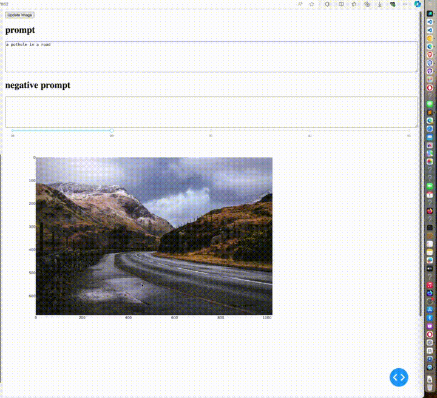
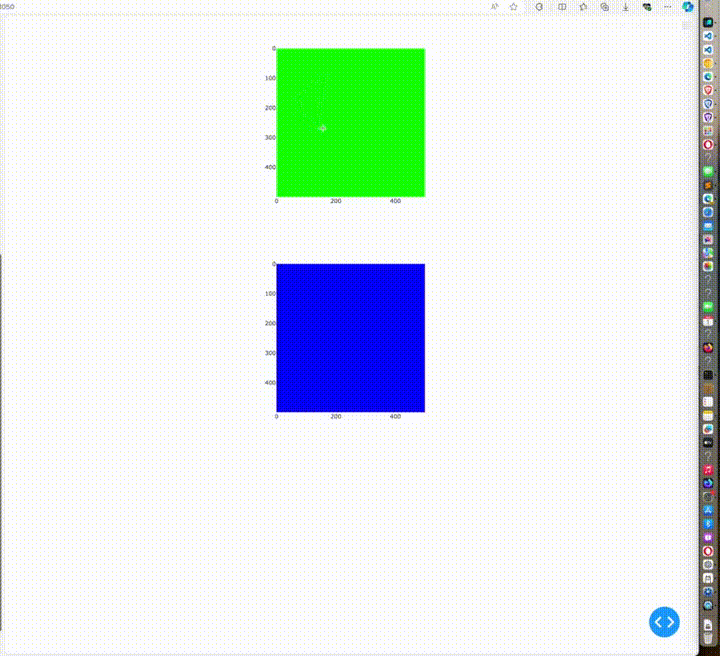

# introduction

lasso selector ( 마우스 누른 채로 움직이면서 polygon 그리는 것 )로 영역 지정 후에 inpainting하는 UI





diffusion UI는 기능도 많고 내겐 너무 복잡하여 많아서, 단순히 plotly dash를 사용함

UI에서 diffusion model를 콜하는 방법으로는 
1. dash app 안에서 그냥 로딩해서 사용
2. fastapi 등 이용
3. gradio server 올린 후, gradio client로 통신 

1번은 ui 로드할 때마다 너무 오래걸려서 ui를 수정하기가 힘들고 
2번은 복잡함 

3번은 gradio server 올려서 실행해보고, 잘 되면, gradio client 이용해서 콜하면 되는데, 
이는 매우 간단함


dash에서 polygon 쓰는 방법을 간단히 보기 위해 

```bash
demo-lasso.py
```
를 실행하면 됨.


위 이미지에서 폴리곤을 그리면, 아래 이미지에 그대로 복사붙여넣기됨

단순히 copy paste 자리에 diffusion model이 들어가고 몇 가지 옵션을 추가하면 

inpainting ui가 되는 것임





## 설치

justfile 사용시
```bash
just install
```

그냥 설치시, 

```bash
conda env list | grep  $PWD/venv || conda create -y --prefix $PWD/venv python=3.11 pip ipykernel
conda activate $PWD/venv

pip install -U -r requirements.txt
pip install -e .
```

기존쓰던 환경을 그대로 쓰려면, 


```bash
pip install -U -r requirements.txt
pip install -e .
```


##  실행

먼저 gradio server를 실행한 후 
```bash
python gradio-server.py
```

dash app을 실행
```bash
python app.py
```

