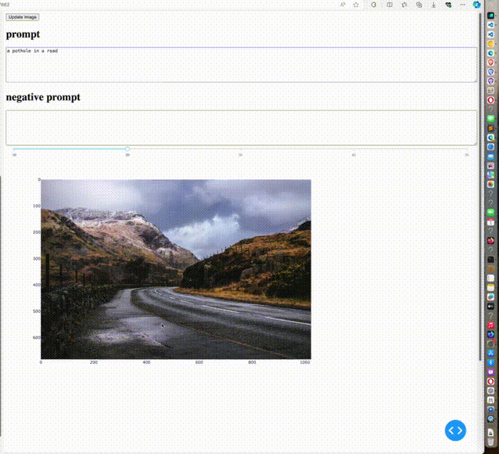

# Introduction

This UI allows you to select an area using a lasso selector (drawing a polygon while holding down the mouse button) and perform inpainting.



The Diffusion UI has many features and is too complex for me, so I simply used Plotly Dash.

There are three ways to call the diffusion model from the dash UI:

1. Load it directly within the Dash app.
2. Use FastAPI or similar.
3. Run a Gradio server and communicate with it using a Gradio client.

to my opinion,
Option 1 takes too long to load the UI each time, making it difficult to make changes to the UI.
Option 2 is complicated.
Option 3 involves running a Gradio server and then calling it using a Gradio client, which is very simple and easy to debug.

To see a simple example of using lasso selector in Dash, run:

```bash
demo-lasso.py
```

When you draw a polygon in the top image, it is copied and pasted into the bottom image. 
By replacing simple copy-paste action with the diffusion model calling and adding a few options, you get an inpainting UI!


## Installation

Using justfile:

```bash
just install
```


If installing manually:

```bash
conda env list | grep  $PWD/venv || conda create -y --prefix $PWD/venv python=3.11 pip ipykernel
conda activate $PWD/venv

pip install -U -r requirements.txt
pip install -e .
```


## Running

First, start the Gradio server:

```bash
python gradio-server.py
```

then, run dash app
```bash
python app.py
```